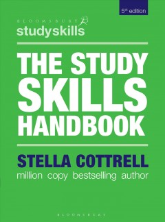
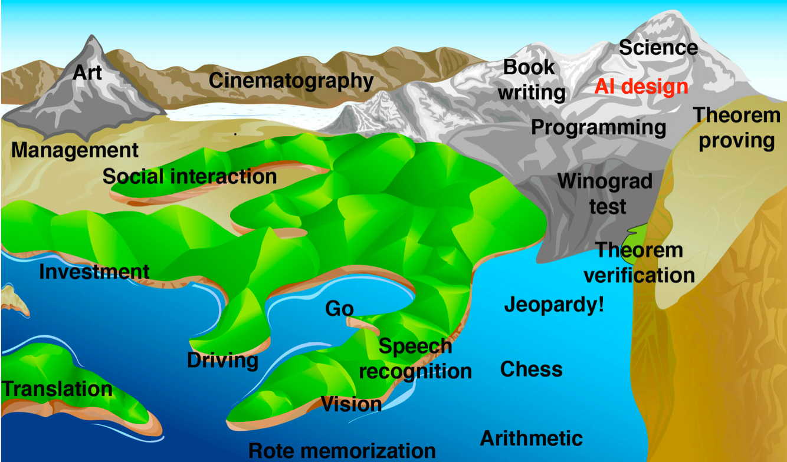

# Data lab preps
**index**

- [Data lab preps](#data-lab-preps)
- [Books for DataLab](#books-for-datalab)
  - [The study skills handbook / Stella Cottrell.](#the-study-skills-handbook--stella-cottrell)
  - [Life 3.0](#life-30)
- [Milestone that we have reached in history](#milestone-that-we-have-reached-in-history)
- [The Loebner prize](#the-loebner-prize)
- [Gimme Gimme Gimme some feeback](#gimme-gimme-gimme-some-feeback)

# Books for DataLab
## The study skills handbook / Stella Cottrell.

Authors:
Cottrell, Stella.

Publication Date:2019.

Accession Number:
    bus.KOHA.OAI.BUAS.35464
## Life 3.0

Authors:
Tegmark, Max.

Publication Date:2017.

Accession Number:
<a hreff="https://books.google.nl/books/about/Life_3_0.html?id=3_otDwAAQBAJ&redir_esc=y"> life 3.0</a>

# Milestone that we have reached in history
In the book Life 3.0 by Max Tegmark i found a rather interesting picture seeing how the book is from 2017
and shows the following image

This image by Hans moravec reprisents what he tought and at that time was able to be achieved by an AI an with recetnly Dall-E has released which is an AI that can make art. Which makes the milestone of art reached even thought it hasnt been a year it still is history.

  *Image generated using Dall E*

# The Loebner prize
The Loebner prize was created in 1990 by Hugh Loebner. And there are 3 medals to be won and they are judged on their imitation game skills. Winning these require you to have the best bot that can pas turings test. The first place goes to the best textual, visual, and auditory proccesing bot. the second place goes to best chatbot that can pass the turing test in a text only format.

# Gimme Gimme Gimme some feeback
**1.2d** List, and describe the advantages and disadvantages of using the following response generation chatbot types:

 * rule-based:
  This type of a chatbot is very simple and consists of If this than that statements. For example if I ask "What i your name" it could reply with a predetirment "My name is eliza"

| Pros | Cons |
|------|------|
|*Eazy to produce. *doesn't require machine learning or ai     |*Can only reply to written dow replies *has only limted capabilty to awnser qeuston because it can only grab from its database.       |
  * retrieval-based:This form of chatbots use Machine learning models such as NLP to make conversation.

  | Pros | Cons |
|------|------|
|*Can awnser more qeustions than rule based. *Given eneugh data it can reply to almost everything and also procceses more then words like grammer     |*Takes more storage and energy *Cant awnser qeustions by combining information.    |
  * generative: The mostly of all 3 to pass the Turing test, Generative chatbots arae able to formulate their own response based on what is being asked.
  
| Pros | Cons |
|------|------|
|*Can awnser virtualy any qeustion. *Can reply in more accurately the qeustion at hand.     |*Takes even more data to train *Is more likly to make grammatical errors or nonsensical replies.       |