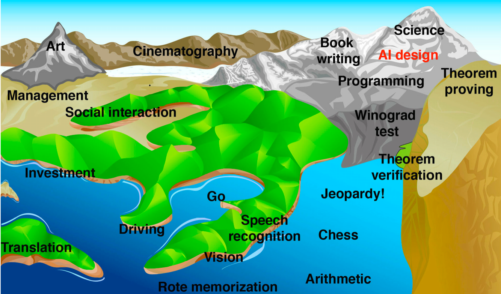

# Books for DataLab
## The study skills handbook / Stella Cottrell.

Authors:
Cottrell, Stella.

Publication Date:2019.

Accession Number:
    bus.KOHA.OAI.BUAS.35464
## Life 3.0

Authors:
Tegmark, Max.

Publication Date:2017.

Accession Number:
<a hreff="https://books.google.nl/books/about/Life_3_0.html?id=3_otDwAAQBAJ&redir_esc=y"> life 3.0</a>

# Milestone that we have reached in history
In the book Life 3.0 by Max Tegmark i found a rather interesting picture seeing how the book is from 2017
and shows the following image

This image by Hans moravec reprisents what he tought and at that time was able to be achieved by an AI an with recetnly Dall-E has released which is an AI that can make art. Which makes the milestone of art reached even thought it hasnt been a year it still is history.

  *Image generated using Dall E*