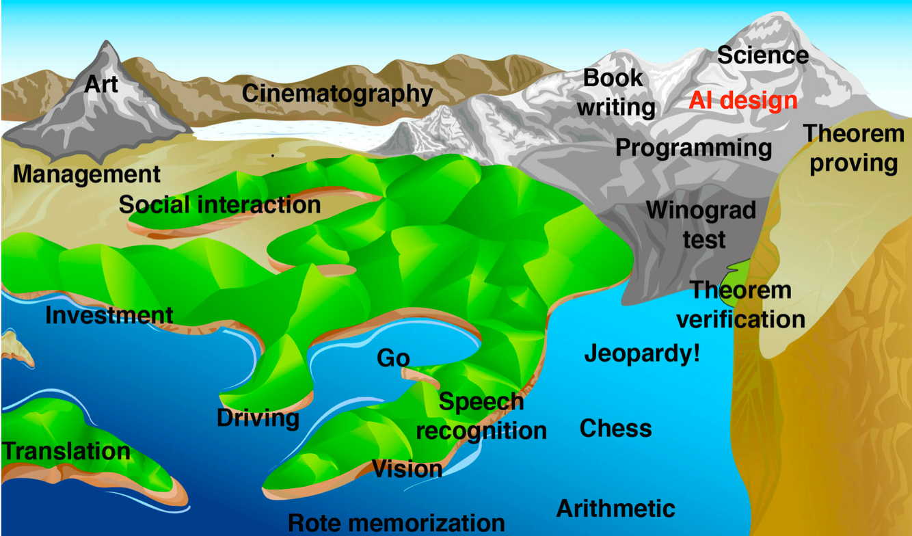
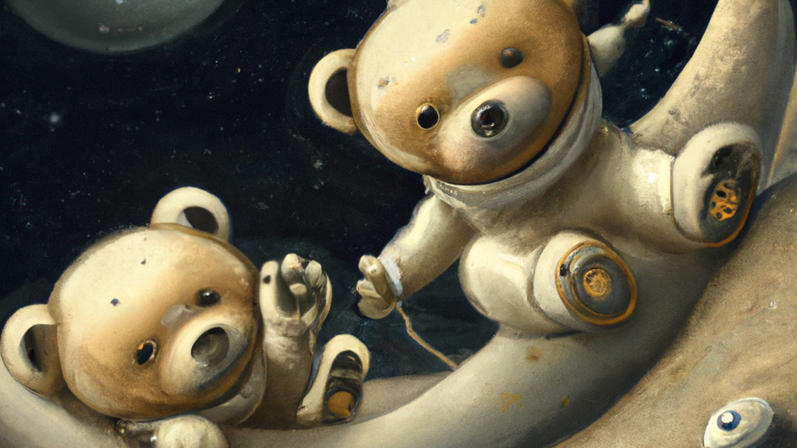

# day 2
**goals for today**
1. List, and describe key moments in the history of AI
2.  Explain the procedure, and main objective of Turing's ‘Imitation Game'
3. Implement version control using ‘GitHub Desktop,' a Graphical User Interface for GitHub

**1.1C** In the book Life 3.0 by Max Tegmark i found a rather interesting picture seeing how the book is from 2017
and shows the following image

This image by Hans moravec reprisents what he tought and at that time was able to be achieved by an AI an with recetnly Dall-E has released which is an AI that can make art. Which makes the milestone of art reached even thought it hasnt been a year it still is history.

Image generated using Dall E

**1.2B**Besides the Turing Test, Alan Turing is renowned for his work on: 